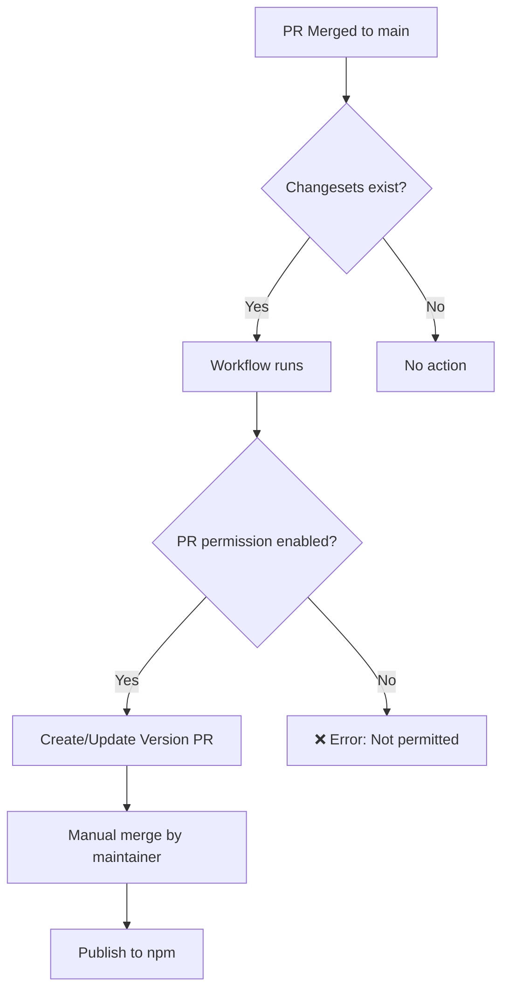

# Release Workflow - Quick Setup Checklist

Use this checklist to quickly enable the automated release workflow.

## Prerequisites

- [ ] You are an **organization owner** (for `objectstack-ai`)
- [ ] You have **admin access** to the repository

## Setup Steps

### 1. Organization Settings (Organization Owners Only)

- [ ] Navigate to: https://github.com/organizations/objectstack-ai/settings/actions
- [ ] Scroll to **"Workflow permissions"** section
- [ ] Check the box: **☑ Allow GitHub Actions to create and approve pull requests**
- [ ] Click **Save**

### 2. Repository Settings

- [ ] Navigate to: https://github.com/objectstack-ai/objectql/settings/actions
- [ ] Scroll to **"Workflow permissions"** section  
- [ ] Check the box: **☑ Allow GitHub Actions to create and approve pull requests**
- [ ] Click **Save**

### 3. Verify Required Secrets

- [ ] `NPM_TOKEN` is configured in repository secrets
  - Path: Settings > Secrets and variables > Actions > Repository secrets
  - Should contain a valid npm publish token

### 4. Test the Workflow

- [ ] Merge a PR with a changeset to `main` branch
- [ ] Check workflow runs at: https://github.com/objectstack-ai/objectql/actions
- [ ] Verify a "Version Packages" PR is created automatically

## Troubleshooting

### ❌ Error: "GitHub Actions is not permitted to create or approve pull requests"

**Status**: Setting not enabled  
**Fix**: Complete steps 1 and 2 above

### ❌ Organization setting is grayed out

**Status**: You don't have organization owner permissions  
**Fix**: Contact an organization owner to enable the setting

### ❌ No PR is created, but workflow succeeds

**Status**: No changesets detected  
**Fix**: Contributors need to add changesets using `pnpm changeset`

### ❌ Error: "Resource not accessible by integration"

**Status**: Insufficient workflow permissions  
**Fix**: Verify the workflow has `pull-requests: write` permission (already configured)

## How It Works

## Additional Resources

- 📖 Detailed Guide: [RELEASE_SETUP.md](RELEASE_SETUP.md)
- 🔧 Workflow Documentation: [WORKFLOWS.md](WORKFLOWS.md)
- 📝 Changesets Docs: https://github.com/changesets/changesets

---

**Last Updated**: January 2026  
**Status**: ⚠️ Settings need to be enabled by organization owner
